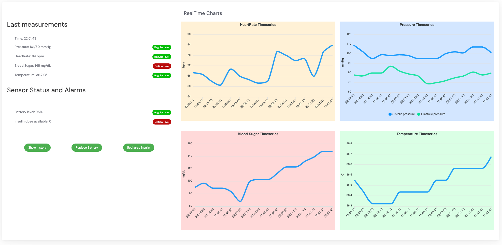
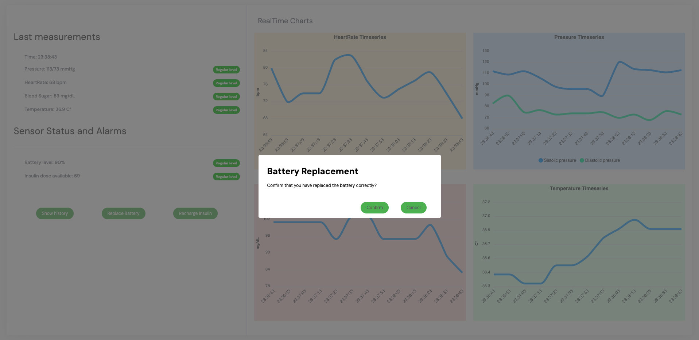
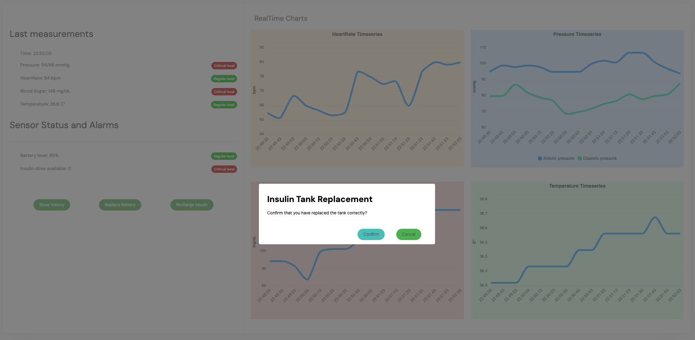
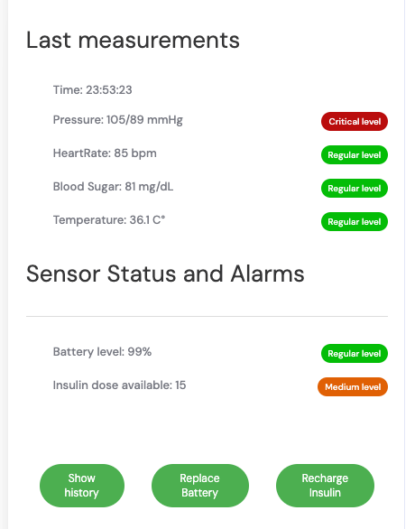
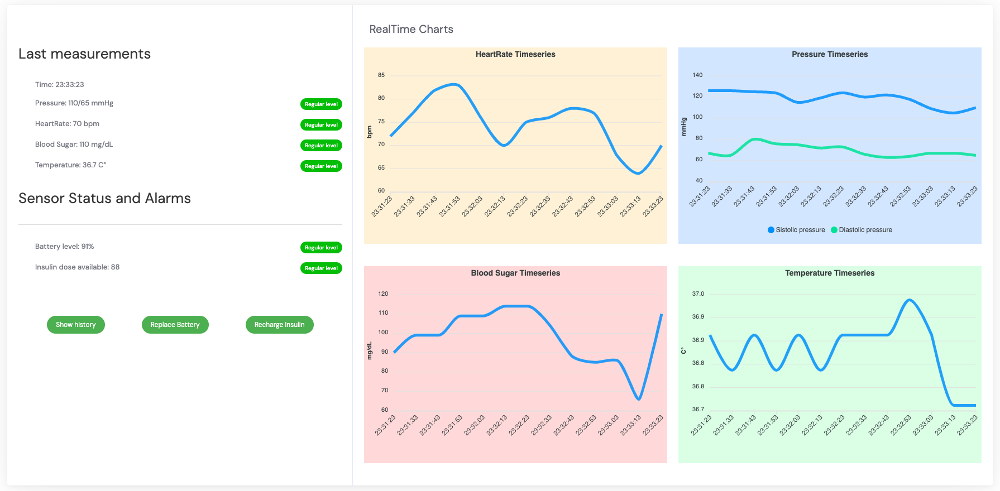
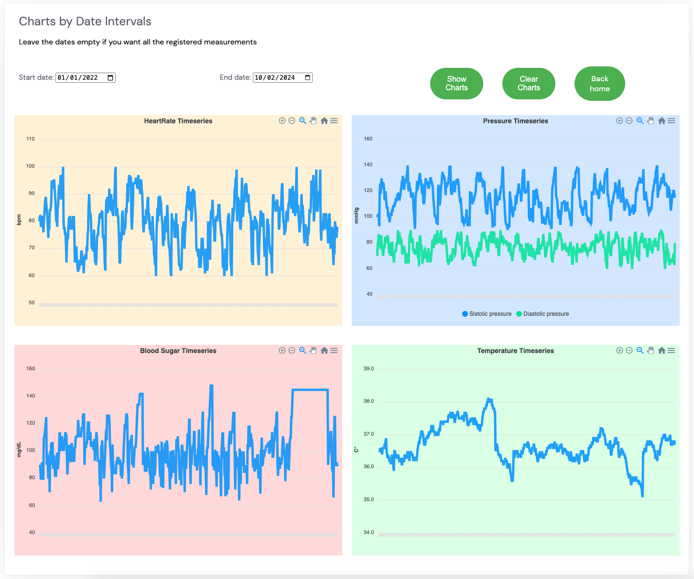

# 💉🩸Pompa di Insulina 🩸💉
> Progetto per il corso di Ingegneria del Software 
> dell'Università degli Studi di Verona.

Il sistema software è stato sviluppato per la gestione di
una pompa di insulina. Il sistema è in grado di monitorare
i parametri vitali del paziente e di erogare insulina in caso
di necessità, fornendo inoltre un'interfaccia grafica per
l'analisi dei dati.

## Indice
1. [🗳️ Scaricare il progetto](#scaricare-il-progetto)
2. [📝 Casi d'uso](#casi-duso)
3. [📈 Scenari](#scenari)
4. [📚 Documentazione API relative ai sensori](#documentazione-api-relative-ai-sensori)
5. [📚 Documentazione API Parametri Vitali](#documentazione-api-parametri-vitali)
6. [🧪 Test](#test)
7. [👨‍💻 Autori](#autori)

---


## <a id="scaricare-il-progetto"></a> Scaricare il progetto
Per scaricare il progetto è necessario clonare la repository
tramite il comando `git clone https://github.com/alessiogj/Insulin-pump.git`.
Dopodiché è necessario eseguire il comando `gradle build` per
scaricare le dipendenze e compilare il progetto. Per eseguire
il progetto è necessario eseguire il comando `gradle bootRun`, 
che avvierà il server sulla porta `8080`.

---
## <a id="casi-duso"></a> Casi d'uso


---
## <a id="scenari"></a> Scenari

### 📉 Livello di glucosio in diminuzione `(r2 < r1)`

- **Assunzione iniziale**: Un utente porta con se un dispositivo che misura i parametri
vitali del paziente. Il dispositivo è in grado di misurare la pressione sanguigna,
la frequenza cardiaca, la temperatura corporea e il livello di zucchero nel sangue.
Il dispositivo è in grado di inviare i dati al server tramite una connessione internet.
La batteria del dispositivo è carica e contiene abbastanza insulita per processare eventuali
richieste. Si assume che i dati ricevuti dal dispositivo siano corretti e che il dispositivo
non invii dati errati e che il livello di insulina sia inferiore a 130.
- **Funzionamento**: Il dispositivo invia i dati al server. Il server riceve i dati e li salva
nel database. Il sistema verifica se i dati relativi al glucosio non siano fuori dai limiti
accettabili. Se il livello di glucosio sta decrementando nel tempo, l'erogazione di insulina
non avviene.
- **Cosa può andare storto**: La batteria della pompa di insulina si scarica. In questo caso 
i parametri vitali del paziente non vengono più monitorati e non è possibile erogare insulina.
In questo caso si assume che nel tempo continuino a variare, portando quindi il livello di insulina 
fuori dai limiti accettabili. In questo caso il sistema non è in grado di erogare insulina.

### 🧘 Livello di glucosio stabile `(r2 = r1)`

- **Assunzione iniziale**: Un utente porta con se un dispositivo che misura i parametri
  vitali del paziente. Il dispositivo è in grado di misurare la pressione sanguigna,
  la frequenza cardiaca, la temperatura corporea e il livello di zucchero nel sangue.
  Il dispositivo è in grado di inviare i dati al server tramite una connessione internet.
  La batteria del dispositivo è carica e contiene abbastanza insulita per processare eventuali
  richieste. Si assume che i dati ricevuti dal dispositivo siano corretti e che il dispositivo
  non invii dati errati e che il livello di insulina sia inferiore a 130.
- **Funzionamento**: Il dispositivo invia i dati al server. Il server riceve i dati e li salva
  nel database. Il sistema verifica se i dati relativi al glucosio non siano fuori dai limiti
  accettabili. Se il livello di glucosio è stabile nel tempo, l'erogazione di insulina
  non avviene.
- **Cosa può andare storto**: La batteria della pompa di insulina si scarica. In questo caso
  i parametri vitali del paziente non vengono più monitorati e non è possibile erogare insulina.
  In questo caso si assume che nel tempo continuino a variare, portando quindi il livello di insulina
  fuori dai limiti accettabili. In questo caso il sistema non è in grado di erogare insulina.

### 📈 Livello di glucosio in aumento `((r2 – r1) ≥ (r1 – r0))` e il risultato è diverso da `0`
- **Assunzione iniziale**: Un utente porta con se un dispositivo che misura i parametri
  vitali del paziente. Il dispositivo è in grado di misurare la pressione sanguigna,
  la frequenza cardiaca, la temperatura corporea e il livello di zucchero nel sangue.
  Il dispositivo è in grado di inviare i dati al server tramite una connessione internet.
  La batteria del dispositivo è carica e contiene abbastanza insulita per processare eventuali
  richieste. Si assume che i dati ricevuti dal dispositivo siano corretti e che il dispositivo
  non invii dati errati e che il livello di insulina sia inferiore a 130.
- **Funzionamento**: Il dispositivo invia i dati al server. Il server riceve i dati e li salva
  nel database. Il sistema verifica se i dati relativi al glucosio non siano fuori dai limiti
  accettabili. Se il livello di glucosio è in aumento nel tempo, l'erogazione di insulina
  avviene per abbassare il livello di glucosio del paziente e portarlo entro i limiti accettabili
  secondo il seguente calcolo:
  - `se l'ultima misurazione - prima misurazione è maggiore o uguale alla differenza tra la
    prima e la seconda misurazione`
  - `La dose di compnsazione è calcolata come la differenza tra la prima e la seconda misurazione diviso 4`
  - `Se la dose di compensazione è un valore minore di 1 e maggiore di 0, la dose di compensazione è 1`
  - `Se la dose di compensazione è un valore maggiore di 1, la dose di compensazione è il valore arrotondato
    all'intero più vicino`

### 📈 Livello di glucosio in aumento `((r2 – r1) ≥ (r1 – r0))` e il risultato è uguale da `0`

- **Assunzione iniziale**: Un utente porta con se un dispositivo che misura i parametri
  vitali del paziente. Il dispositivo è in grado di misurare la pressione sanguigna,
  la frequenza cardiaca, la temperatura corporea e il livello di zucchero nel sangue.
  Il dispositivo è in grado di inviare i dati al server tramite una connessione internet.
  La batteria del dispositivo è carica e contiene abbastanza insulita per processare eventuali
  richieste. Si assume che i dati ricevuti dal dispositivo siano corretti e che il dispositivo
  non invii dati errati e che il livello di insulina sia inferiore a 130.
- **Funzionamento**: Il dispositivo invia i dati al server. Il server riceve i dati e li salva
  nel database. Il sistema verifica se i dati relativi al glucosio non siano fuori dai limiti
  accettabili. Se il livello di glucosio è in aumento nel tempo, l'erogazione di insulina
  avviene per abbassare il livello di glucosio del paziente e portarlo entro i limiti accettabili
  secondo il seguente calcolo:
  - `se l'ultima misurazione - prima misurazione è maggiore o uguale alla differenza tra la
    prima e la seconda misurazione`
  - `La dose di compnsazione è calcolata come la differenza tra la prima e la seconda misurazione diviso 4`
  - `Se la dose di compensazione è 0, la dose di compensazione sarà la dose minima, ovvero 1`

### 🚨 Livello di glucosio fuori dai limiti accettabili `livello glucosio ≥ 130`

- **Assunzione iniziale**: Un utente porta con se un dispositivo che misura i parametri
  vitali del paziente. Il dispositivo è in grado di misurare la pressione sanguigna,
  la frequenza cardiaca, la temperatura corporea e il livello di zucchero nel sangue.
  Il dispositivo è in grado di inviare i dati al server tramite una connessione internet.
  La batteria del dispositivo è carica e contiene abbastanza insulita per processare eventuali
  richieste. Si assume che i dati ricevuti dal dispositivo siano corretti e che il dispositivo
  non invii dati errati e che il livello di insulina sia maggiore o uguale a 130.
- **Funzionamento**: Il dispositivo invia i dati al server. Il server riceve i dati e li salva
  nel database. Il sistema verifica se i dati relativi al glucosio non siano fuori dai limiti
  accettabili. Se il livello di glucosio è fuori dai limiti accettabili, in qualunque situazione,
  la pompa erogherà insulina per abbassare il livello di glucosio del paziente e portarlo entro
  i limiti accettabili.
- **Cosa può andare storto**: La batteria della pompa di insulina si scarica. In questo caso
    i parametri vitali del paziente non vengono più monitorati e non è possibile erogare insulina.
    In questo caso si assume che nel tempo continuino a variare, portando quindi il livello di insulina
    fuori dai limiti accettabili. In questo caso il sistema non è in grado di erogare insulina.

<div align="center">
  
</div>

### 🔋 Malfunzionamento della Pompa di Insulina per Batteria Scarica

- **Assunzione Iniziale:**
Il sistema, che normalmente esegue misurazioni periodiche dei parametri vitali
del paziente, è inattivo a causa della batteria scarica della pompa di insulina.

- **Funzionamento Anomalo:**
A causa della batteria scarica, il sistema non può effettuare le misurazioni periodiche
dei parametri vitali e, di conseguenza, non può erogare insulina.

- **Soluzione:**
Per simulare la sostituzione della batteria della pompa di insulina, cliccare sul pulsante
`Replace Battery` nella pagina principale.

- **Feedback Utente:**
  Il sistema mostra la label relativa al livello della batteria in rosso, per indicare  
  che la batteria della pompa di insulina è scarica.

<div align="center">
  
</div>

### 🔄 Serbatoio della Pompa di Insulina Vuoto

- **Assunzione Iniziale:**
Se il serbatoio della pompa di insulina è vuoto, il sistema non può erogare insulina.

- **Funzionamento Anomalo:**
Il sistema non riesce a erogare insulina anche quando il livello di glucosio è fuori
dai limiti accettabili o in aumento, peggiorando così le condizioni del paziente.
I parametri vitali mostrano valori fuori norma.

- **Feedback Utente:**
Il sistema mostra la label relativa al livello di insulina in rosso, per indicare
che la pompa di insulina non è in grado di erogare insulina.

- **Soluzione:**
Per simulare il rifornimento del serbatoio della pompa di insulina, cliccare sul
pulsante `Recharge Insulin` nella pagina principale.

<div align="center">
  
</div>

### 🌡️ Monitoraggio dello stato di salute del paziente mediante i parametri vitali dell'ultima misurazione

- **Assunzione Iniziale:** Il sistema è in grado di monitorare i parametri vitali del paziente
    e di erogare insulina in caso di necessità. Il sistema è in grado di memorizzare i dati
    relativi ai parametri vitali del paziente in un database persistente, rendendoli accessibili
    anche dopo la chiusura dell'applicativo.
- **Funzionamento:** Il sistema mostra lo stato di salute del paziente mediante label interative 
    che cambiano colore in base ai parametri vitali dell'ultima misurazione. In particolare:
    - La label relativa alla pressione sanguigna cambia colore in base ai valori di pressione
    sanguigna sistolica e diastolica. Se i valori sono entrambi fuori dai limiti accettabili,
    la label diventa rossa. Se i valori sono entrambi entro i limiti accettabili, la label
    diventa verde.
    - La label relativa alla frequenza cardiaca cambia colore in base al valore della frequenza
    cardiaca. Se il valore è fuori dai limiti accettabili, la label diventa rossa. Se il valore
    è entro i limiti accettabili, la label diventa verde.
    - La label relativa alla temperatura corporea cambia colore in base al valore della temperatura
    corporea. Se il valore è fuori dai limiti accettabili, la label diventa rossa. Se il valore
    è entro i limiti accettabili, la label diventa verde.
    - La label relativa al livello di glucosio nel sangue cambia colore in base al valore del livello
    di glucosio nel sangue. Se il valore è fuori dai limiti accettabili, la label diventa rossa.
    Se il valore è entro i limiti accettabili, la label diventa verde.

<div align="center">
  
</div>


### 💾 Memorizzazione e Visualizzazione dei Dati

- **Funzionalità:**
Il sistema memorizza i dati relativi ai parametri vitali del paziente in un
database persistente, rendendoli accessibili anche dopo la chiusura dell'applicativo.
I dati possono essere visualizzati in diversi formati grafici, sia in tempo reale che
con selezione di un intervallo temporale.

### 📊 Analisi dei Dati in Tempo Reale

- **Funzionalità:**
Il sistema analizza i dati vitali, mostrando grafici in tempo reale per la pressione sanguigna,
la frequenza cardiaca, la temperatura corporea e il livello di glucosio nel sangue. Questi grafici
si aggiornano ogni 10 secondi, a condizione che la batteria sia carica. Ricaricando la pagina, i
grafici riprenderanno a mostrare i dati in tempo reale dal momento del refresh.

<div align="center">
  
</div>

### 📆 Analisi dei Dati con Selezione dell'Intervallo Temporale

- **Funzionalità:**
Il sistema offre la possibilità di visualizzare grafici dei parametri vitali
(_pressione sanguigna, frequenza cardiaca, temperatura corporea, livello di glucosio nel sangue_)
basati su un intervallo temporale selezionato. Questa funzionalità è disponibile indipendentemente
dallo stato della batteria della pompa di insulina.

<div align="center">
  
</div>

---

> ⚠️ **Nota**: Per simulare tale funzionamento i dati sono stati generati casualmente
> e non sono reali. I dati sono stati generati in modo tale da simulare un costante aumento 
> della glicemia, potendo quindi simulare eventuali erogazioni di insulina.

> ⚠️ **Nota**: Si assume che il cambio della batteria e la ricarica della pompa avvengano e 
> non vi siano problematiche legate a quelle operazioni.

---
## <a id="documentazione-api-relative-ai-sensori"></a> Documentazione API relative ai sensori

### 1. Cambio della batteria del pompa di insulina
- **Descrizione**: Sostituisce la batteria della pompa di insulina.
- **URL**: `/sensors/battery/replace`
- **Metodo**: `PUT`
- **Corpo della Richiesta**: Vuoto
- **Risposta**: `200 OK` se la sostituzione è avvenuta con successo

### 2. Ricarica del serbatoio del pompa di insulina
- **Descrizione**: Ricarica il serbatoio della pompa di insulina.
- **URL**: `/sensors/tank/refill`
- **Metodo**: `PUT`
- **Corpo della Richiesta**: Vuoto
- **Risposta**: `200 OK` se la ricarica è avvenuta con successo

### 3. Stato dei sensori
- **Descrizione**: Restituisce lo stato dei sensori della pompa di insulina.
- **URL**: `/sensors/status`
- **Metodo**: `GET`
- **Corpo della Richiesta**: Vuoto
- **Risposta**: Ogggetto `SensorStatusDto` con i dettagli dello stato dei sensori

Schema JSON dell'oggetto `SensorStatusDto`:
```json
{
  "battery" : 100,
  "tank"    : 100
}
``` 
---
## <a id="documentazione-api-parametri-vitali"></a> Documentazione API Parametri Vitali

### 1. Ricerca Parametri Vitali per Intervallo Temporale
- **Descrizione**: Restituisce i parametri vitali del paziente per un determinato intervallo temporale.
- **URL**: `/vitalparameters/date`
- **Metodo**: `GET`
- **Corpo della Richiesta**: Oggetto `DateIntervalDto` con date di inizio e fine.
- **Risposta**: `Iterable<VitalParametersDto>` con i parametri vitali.

Schema `JSON` per la richiesta di ricerca per rntervallo
```json
{
  "startDate" : "2021-01-01T00:00:00",
  "endDate"   : "2021-01-01T00:00:00"
}
```

Schema `JSON` per la risposta di ricerca per intervallo temporale
```json
[
  {
    "timestamp": "2023-01-06T14:07:11.530341",
    "bloodPressureSystolic": 120,
    "bloodPressureDiastolic": 80,
    "heartRate": 70,
    "bloodSugarLevel": 100,
    "temperature": 36.5
  },
  {
    "timestamp": "2023-01-06T14:07:11.530341",
    "bloodPressureSystolic": 110,
    "bloodPressureDiastolic": 70,
    "heartRate": 80,
    "bloodSugarLevel": 100,
    "temperature": 36.5
  }
]
```

### 2. Recuperare tutti i parametri vitali 
- **Descrizione**: Restituisce tutti i parametri vitali del paziente.
- **URL**: `/vitalparameters`
- **Metodo**: `GET`
- **Corpo della Richiesta**: Vuoto
- **Risposta**: `Iterable<VitalParametersDto>` con i parametri vitali.

Schema `JSON` per la risposta di ricerca per intervallo temporale
```json
[
  {
    "timestamp": "2023-01-06T14:07:11.530341",
    "bloodPressureSystolic": 120,
    "bloodPressureDiastolic": 80,
    "heartRate": 70,
    "bloodSugarLevel": 100,
    "temperature": 36.5
  },
  {
    "timestamp": "2023-01-06T14:07:11.530341",
    "bloodPressureSystolic": 110,
    "bloodPressureDiastolic": 70,
    "heartRate": 80,
    "bloodSugarLevel": 100,
    "temperature": 36.5
  }
]
```

### 3. Recupero dell'ultimo parametro vitale
- **Descrizione**: Restituisce l'ultimo parametro vitale del paziente.
- **URL**: `/vitalparameters/last`
- **Metodo**: `GET`
- **Corpo della Richiesta**: Vuoto
- **Risposta**: `VitalParametersDto` con l'ultimo parametro vitale.
- **Errore**: `404 Not Found` se non sono presenti parametri vitali.

Schema `JSON` per la risposta di ricerca per intervallo temporale
```json
{
  "timestamp": "2023-01-06T14:07:11.530341",
  "bloodPressureSystolic": 120,
  "bloodPressureDiastolic": 80,
  "heartRate": 70,
  "bloodSugarLevel": 100,
  "temperature": 36.5
}
```

### 4. Eliminazione di tutte le misurazioni precedenti 
- **Descrizione**: Elimina tutte le misurazioni precedenti.
- **URL**: `/vitalparameters`
- **Metodo**: `DELETE`
- **Corpo della Richiesta**: Vuoto
- **Risposta**: `204 No Content` se l'eliminazione è avvenuta con successo.
---
## <a id="test"></a> Test

`TODO`

---
## <a id="autori"></a> Autori
- [Alessio Gjergji](https://github.com/alessiogj)
- [Nicolò Piccoli](https://github.com/nickkpiccoli)
